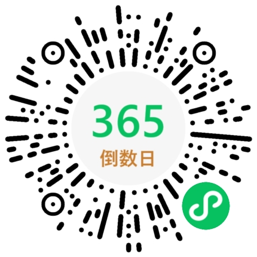

# 我的微信小程序

2020 年 12 月 5 日 PMP 考试备考期间，入门了微信小程序开发。目前，考试顺利通过了，小程序在持续迭代中。

## `Days Matter`

倒数日，这个一个工具类小程序，目前版本 v1.2.1。

第一个版本于 2020 年国庆上线，从开发到上线只用了 3 天，采用了 `WeUI` 库，数据存在本地缓存里。界面就两个，比较简单，也不收集用户数据。结果很多用户反馈无法跨设备使用、记录不见了，这不都因为采用了本地缓存嘛。还有用户反馈点击新增页面无响应、页面卡顿，排查了下，应该是 `WeUI` 框架自身 `BUG` 导致的，并且目前已经9个月未更新。

于是在 2021 年暑假期间上线了第二个版本，依然不收集用户隐私。这个版本，采用了云开发模式，每个月 6.9 元，相当不错了，3 万用户可以跨设备使用，清缓存也不怕，重要的是不收集用户隐私。放弃了 `WeUI` 框架，直接以官方云开发示例为蓝本，页面也多了起来。加入了万恶的微信广告栏位，广告内容由微信统一大理，广告收益每天几毛钱，用于抵消云开发资源成本而已。

这家伙扫码即可使用，代码详见 `days-matter-cloud` 目录。

## 开发资源

本微信小程序，均采用微信官方开发工具，参考官方开发文档，并以官方例子为蓝本。相关参考资源如下：

* 官方开发文档：https://developers.weixin.qq.com/miniprogram/dev/framework/
* 官方开发工具：https://developers.weixin.qq.com/miniprogram/dev/devtools/devtools.html
* 微信云开发：https://cloud.weixin.qq.com/cloudbase